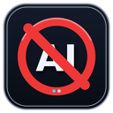

# YouTube AI Video Blocker

<p align="center">
  
</p>

A lightweight Manifest V3 browser extension that hides YouTube video cards when their title or channel name contains configured AI-related keywords.

> **Important:** This is a keyword-based filter. It does not inspect video content and does not technically prove whether a video was generated by AI.

## Features

- Filters YouTube's home feed, search results, sidebar recommendations, grids and Shorts.
- Checks both video titles and channel names.
- Handles dynamically loaded content with `MutationObserver`.
- Re-runs after YouTube's client-side navigation changes.
- Uses inline hiding, so no separate stylesheet is required.
- No analytics, accounts, external API calls or telemetry.
- No extension permissions beyond running the content script on YouTube pages.

The current keyword list includes terms associated with tools and phrases such as `Sora AI`, `Midjourney`, `DALL-E`, `Stable Diffusion`, `Runway`, `AI generated`, `made with AI`, `AI video` and related expressions.

## Installation

### Chrome / Chromium

1. Download or clone this repository.
2. Open `chrome://extensions/`.
3. Enable **Developer mode**.
4. Choose **Load unpacked**.
5. Select the repository folder containing `manifest.json`.
6. Open or reload YouTube.

The extension should then run automatically on YouTube pages.

Other Chromium-based browsers normally provide an equivalent extensions/developer-mode page and can load Manifest V3 unpacked extensions in the same way.

## Customising the filter

Edit the `aiKeywords` array near the top of `content.js`:

```js
const aiKeywords = [
  "ai generated",
  "sora ai",
  "midjourney",
  // add or remove keywords here
];
```

Matching is case-insensitive because the extension converts the inspected text to lowercase before comparing it with the keyword list.

## How it works

The extension scans supported YouTube video-card elements, reads visible title data and the associated channel name, combines that text and checks whether any configured keyword is present. Matching video cards are hidden with `display: none`.

YouTube loads and replaces content dynamically, so the extension also watches DOM changes and reacts when the page URL changes without a full page reload.

## Privacy

The extension operates locally in the browser. The supplied source code contains no analytics, telemetry, remote API calls or data-upload logic.

For debugging, blocked video titles can be written to the local browser developer console. These console messages are not transmitted by the extension.

## Limitations

- Detection is based on words in titles and channel names, not media analysis.
- False positives and false negatives are possible.
- AI-generated media that does not use a matching keyword will not be hidden.
- Non-AI content can be hidden if its title or channel name contains a configured keyword.
- YouTube can change its internal HTML structure, which may require selector updates in future versions.

## Repository protection

This repository includes:

- `.github/CODEOWNERS` so changes can be assigned to the repository owner for review.
- A GitHub Actions validation workflow that checks JavaScript syntax and verifies that `manifest.json` parses correctly on pushes and pull requests.
- `SECURITY.md` for responsible vulnerability reporting.

For a public GitHub repository, also enable a ruleset for the `main` branch in **Settings → Rules → Rulesets**. Recommended settings are:

1. Require a pull request before merging.
2. Require at least one approval.
3. Require review from Code Owners.
4. Require the `Validate extension` status check to pass.
5. Block force pushes.
6. Block branch deletion.
7. Require conversation resolution before merging.

If you work alone and want to commit directly to `main`, omit the pull-request requirement but keep force-push/deletion protection and the validation workflow.

## Project structure

```text
youtube-ai-video-blocker/
├── .github/
│   ├── CODEOWNERS
│   └── workflows/
│       └── validate.yml
├── icons/
│   ├── icon16.png
│   ├── icon32.png
│   ├── icon48.png
│   ├── icon128.png
│   └── icon512.png
├── content.js
├── manifest.json
├── LICENSE
├── README.md
├── SECURITY.md
└── .gitignore
```

## License

Released under the [MIT License](LICENSE).

Copyright © 2026 Janus Rokkjær.

## Disclaimer

YouTube is a trademark of Google LLC. This project is an independent browser extension and is not affiliated with, endorsed by or sponsored by YouTube or Google.
